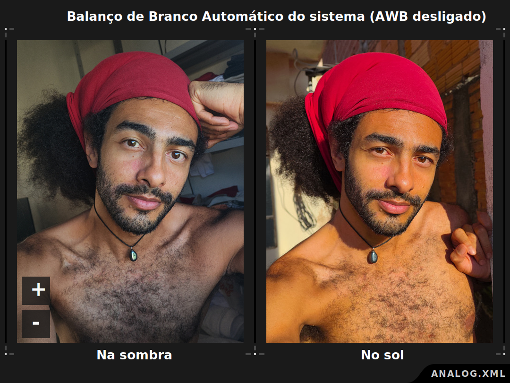

# Analog XML
Analog é um XML de configuração da Google Camera para os aparelhos POCO F4 GT e Redmi K50 Gaming.

[Imagem ilustrativa destacando os recursos de 64MP, granulado natural e cores intensas.]

Com visual inspirado em fotos de filme, tiradas com câmera analógica, Analog tem cores fortes, alta definição e granulado natural.
## Autoria
Criado por Paulo José @paulotwain, 2022-2023. Sou programador, artista e trabalho com fotografia e edição de imagem há 20 anos.

Conheci a Google Camera em 2018, e desde então gosto de testar novas versões e conhecer as tecnologias usadas no app.
## Download
Versão mais recente em [Releases](https://github.com/pauloup/analog-xml/releases).

Feito para a Google Camera 8.4 do Shamim: [SGCAM_8.4.400.42.XXX_STABLE_V43_ENG.apk](https://t.me/googlecameramodbyshamim/789?single)

A versão ENG é recomendada para ativar o recurso [Google Lens](#Google%20Lens), mas a versão principal ou a SNAPCAM também podem ser usadas.
## Instalação
Copie o XML para a pasta *SGCAM/XML*. Abra o app, dê dois toques no espaço vazio ao lado do botão de disparo, e importe a configuração.

[Imagem dos 3 passos de instalação.]
## Fotos
Fotos tiradas na SGCAM 8.4 com Analog:

Incluir:
- Principal
- Ultra Angular
- Macro
- Frontal
- Retrato
- Visão Noturna
- Preto e Branco
- Qualidade Máxima
- Luz real
- Vinheta real
- Exposição manual
- Longa exposição
- Zoom digital
- Astrofotografia
## Visão geral
Analog busca retratar a realidade em fotos definidas e intensas, resgatando o visual das fotos de filme, feitas com câmera analógica.

A tecnologia da Google Camera ajuda a enfrentar os desafios da fotografia digital, como perda de detalhes e textura, e cores apagadas.

[Imagem comparando uma fotografia digital e uma analógica. A fotografia digital apresenta perda de detalhes, um visual de pintura a óleo, e cores planas sem contraste. A fotografia analógica tem granulado natural do filme, preserva detalhes e tem cores intensas.]

A qualidade técnica de uma imagem pode ser comparada, mas a beleza é sempre subjetiva. Analog é tão bom quanto qualquer outro XML, basta atender ao que se busca.
### Principais recursos
- [4 Lentes](#4%20Lentes): Todas as lentes otimizadas para fotos similares e consistentes.
- [64MP](#64MP) - Resolução em dobro para nitidez máxima e flexibilidade de recorte.
- [Granulado natural](#Granulado%20natural) - Redução de ruído mínima para preservar detalhes e textura.
- [Cor natural](#Cor%20natural): Balanço de branco quente para destacar tons de pele, sem a frieza digital.
- [Luz natural](#Luz%20natural): Fotos escuras e intensas, com visual de cinema e sombras preservadas.
- [Vídeo](#Vídeo): Estabilização, câmera lenta e 4K 60fps.
### Outros recursos
- [Visão Noturna](#Visão%20Noturna)
- [Retrato](#Retrato)
- [Preto e Branco](#Preto%20e%20Branco)
- [Qualidade Máxima](#Qualidade%20Máxima)
- [HDR+](#HDR+)
- [RAW](#RAW)
- [Melhor Foto](#Melhor%20Foto)
- [Luz real](#Luz%20real)
- [Vinheta real](#Vinheta%20real)
- [Panorama](#Panorama)
- [Photo Sphere](#Photo%20Sphere)
- [Google Lens](#Google%20Lens)

Veja todos na seção [Recursos](#Recursos).
### Outras informações
Esse documento organiza outras informações sobre Analog em sessões:

[Motivação](#Motivação) apresenta a intenção, os desafios e as referências usadas na criação de Analog.

[Interface](#Interface) define o que são os botões e opções na tela, e ensina como usar a Google Camera configurada com Analog.

[Limitações](#Limitações) debate os problemas que podem surgir, e suas possíveis soluções, como ruído alto, cores saturadas e arquivos grandes.

[Dicas](#Dicas) fala de situações que precisam de outros apps, como gravação de vídeo avançada, ou de técnicas, como astro e macrofotografia.

[Alternativas](#Alternativas) traz XMLs adicionais, como o Analog-Flat, que reduz contraste e saturação  para fotos com cores planas, boas para editar.

[Especificações](#Especificações) reúne dados técnicos das lentes do POCO F4 GT e do Redmi K50 Gaming, como abertura, modelo do sensor, e distância de foco.

[Google Camera](#Google%20Camera) explica como a Google Camera funciona quando uma foto é tirada, do momento do disparo, até ser salva na galeria.

[Configurações](#Configurações) lista as principais configurações da Google Camera usadas em Analog, e explica como cada uma contribui para a foto.

[Extras](#Extras) mostra como ativar recursos que não fazem parte de Analog, como RAW no Retrato, Melhor Foto, e vídeo 8K.

[Bugs](#Bugs) são situações em que a Google Camera não funciona como o esperado.

[Glossário](#Glossário) tem palavras especiais das configurações, e termos técnicos comuns nas discussões sobre a Google Camera.

[Changelog](#Changelog) registra as atualizações no desenvolvimento de Analog, de forma técnica.
## Motivação

Analog foi criado unindo técnica e arte em fotos realistas, como um registro histórico, mas com um visual marcante, que já agrada ao meu gosto e não preciso editar pra postar.

A maior referência para o meu trabalho em Analog foi o curso [Fotografia Digital](https://www.youtube.com/playlist?list=PL7ddpXYvFXspUN0N-gObF1GXoCA-DA-7i) de Marc Levoy, um dos criadores da Google Camera.

Os grupos de discussão [SGCam](https://t.me/googlecameramodbyshamimdg), [AGC](https://t.me/AGC_AND_MORE) e [BSG](https://t.me/PublicGroup_MGC_BSG) compartilham experiências únicas sobre o uso da Google Camera, e também foram referência.

### Problemas do digital 
Com o HDR, as fotos perdem contraste e as cores ficam planas, como nessa comparação do Pixel 8 Pro e uma câmera Sony A7 IV.

https://youtu.be/n8nSeVniXSY

## Interface
A interface mostra a imagem da câmera no centro da tela. Os Modos ficam abaixo, as Lentes na direita e as Opções acima.

Abaixo também ficam o botão de disparo no centro, a miniatura da última foto tirada na direita e o botão da Lente Frontal na esquerda.

O indicador de zoom fica parte de baixo da imagem da câmera, e o controle manual de foco na esquerda.

Toque longo no botão da Lente Frontal abre as Configurações Adicionais, e toque longo na miniatura da última foto abre as Opções de Desenvolvedor.

#### Ajuste de exposição na tela
Tocar na imagem da tela para ajustar a compensação de exposição.
### Modos
Os modos ficam na parte de baixo:
- Câmera: Modo principal para fotos.
- [Retrato](#Retrato): Fotos com fundo desfocado.
- [Visão Noturna](#Visão%20Noturna): Fotos com mais qualidade em cenas escuras, com grande extensão de luz, ou muito contraste entre luzes e sombras.
- [Vídeo](#Vídeo): Gravação de vídeo com [Estabilização](#Estabilização) e opções de [Câmera Lenta](#Câmera%20Lenta) e [Timelapse](#Timelapse).
- Modos: [Panorama](#Panorama) e [Photo Sphere](#Photo%20Sphere).
### Lentes
A seleção das lentes traseiras fica na direita:
- Wide (W): Lente Principal de 26mm, f/1.89, sensor Sony de 64MP.
- Ultrawide (UW): Lente Ultra Angular de 16mm, f/2.2 e sensor Omnivision de 8MP.
- Macro (M): Lente Macro de 25mm, f/2.4 e sensor GalaxyCore de 2MP.
- Black and White (BW): Lente Principal em [Preto e Branco](#Preto%20e%20Branco) com um filtro ortocromático.
- High Quality (HQ): Lente Principal em [Qualidade Máxima](#Qualidade%20Máxima) com 48 quadros.

A seleção da lente Frontal fica à esquerda do botão de disparo:
- Selfie: Lente Frontal de 27mm, f/2.24 e sensor Sony de 20MP.
### Opções
#### Opções comuns
- HIRES: 
- LIBP:
- Configurações:
- [AWB](#AWB)
- [Luz real](#Luz%20real)
- [Vinheta real](#Vinheta%20real)
#### Modo Câmera
- Configurações
	- Mais Luz:
	- HDR+:
	- [RAW](#RAW):
	- Temporizador:
	- Proporção:
	- Mais configurações:
	- 
## Recursos
- [4 Lentes](#4%20Lentes)
- [64MP](#64MP)
- [Granulado natural](#Granulado%20natural)
- [Cor natural](#Cor%20natural)
- [Luz natural](#Luz%20natural)
- [Vídeo](#Vídeo)
- [Visão Noturna](#Visão%20Noturna)
- [Retrato](#Retrato)
- [Preto e Branco](#Preto%20e%20Branco)
- [Qualidade Máxima](#Qualidade%20Máxima)
- [HDR+](#HDR+)
- [RAW](#RAW)
- [Melhor Foto](#Melhor%20Foto)
- [Luz real](#Luz%20real)
- [Vinheta real](#Vinheta%20real)
- [Panorama](#Panorama)
- [Photo Sphere](#Photo%20Sphere)
- [Google Lens](#Google%20Lens)
### 4 Lentes
Todas as lentes configuradas: Lente Principal, Ultra Angular, Macro e Frontal.
[Imagem comparando fotos das 4 lentes]
JPG: Principal, Ultra Angular, Macro, Frontal.

As 4 lentes foram otimizadas para entregar um resultado similar e o mais consistente possível.

Algumas situações podem apresentar diferenças nas lentes. Veja [Limitações: Lentes inconsistentes](#Lentes%20inconsistentes).
### 64MP
Fotos com resolução em dobro, com 64MP na lente Principal, 32MP na Ultra Angular, 32MP na Macro e 20MP na Frontal.
Detalhes finos com nitidez e definição, aproveitando o máximo do sensor.
 
Salvar fotos com o dobro da resolução permite recuperar um nível alto de detalhes, com os algoritmos avançados de processamento da Google Camera, e ter o máximo da qualidade.

O algoritmo de Super Res Zoom (Sabre) combina várias fotos para gerar uma só, com o dobro do tamanho e mais nitidez do que só aumentar a imagem na edição.

#### 64MP reais ou interpolados
O sensor da lente Principal tem 64MP reais (9248 x 6944 pixels), mas a POCO só permite essa resolução no app da câmera nativa, e limita as fotos em 16MP (4624 x 3472 pixels) para apps de terceiros, como a Google Camera.

A tecnologia que reduz a foto de 64MP para 16MP é chamada de [Pixel Binning](#Pixel%20Binning), e combina cada grupo de 4 pixels para formar 1 pixel.

Isso reduz o ruído digital e melhora a capitação de luz em cenas escuras, mas a resolução da foto cai pela metade*, e há menos detalhes.

*\*Nota: Por convenção, se diz que a resolução da foto cai pela metade quando largura e altura são ambas reduzidas pela metade. Assim, o total de pixels da foto, que é o número de MegaPixels, cai para 1/4. Por isso, 16MP é "metade da resolução" de 64MP, mesmo sendo 1/4 do valor numérico.*

Para superar essa limitação, Analog usa os recursos de Upscaling ([Raisr](#Raisr)) e Super Res Zoom ([Sabre](#Sabre)) da Google Camera.

Isso aumenta as fotos de 16MP com binning disponíveis para fotos de 64MP interpolados, com qualidade comparável ou ainda superior aos 64MP reais da câmera nativa.

[Comparação de uma foto com 64MP reais da câmera nativa, e uma com 64MP interpolados da Google Camera.]

*JPG: Nativa 64MP reais vs Google Camera 64MP interpolados*.

Aliás, os 64MP da câmera nativa nem sempre são reais. Em situações mais escuras, a câmera nativa também usa os 16MP com pixel binning, e aumenta a imagem pra 64MP, com bem menos qualidade que a Google Camera.

[Comparação de uma foto com 64MP interpolados da câmera nativa, e uma com 64MP interpolados da Google Camera]

*JPG: Nativa 64MP interpolados vs Google Camera 64MP interpolados*.

O mesmo processo é usado nas outras lentes para dobrar a resolução e produzir fotos com mais qualidade que na câmera nativa.

[Imagem das outras 3 lentes com o dobro de resolução em comparação com a câmera nativa.]

Opcional: Esse recurso é ligado por padrão. Desative a opção Alta Resolução (HIRES) para desligar esse recurso e tirar fotos na resolução padrão de 16MP na lente Principal, 8MP na Ultra Angular, 2MP na Macro e 5MP na Frontal.

[Imagem da opção HIRES desativada]
### Granulado natural
Granulado de filme, como numa câmera analógica, preservando o ruído natural da foto.

O uso exagerado de Remoção de Ruído destrói os detalhes finos da imagem, deixando o visual artificial e digital, comum das fotos de celular.

A Google Camera nasceu da ideia de combinar várias fotos para reduzir ruído de forma natural, a mesma tecnologia usada pela NASA pra fotografar o espaço profundo. Assim, não é preciso usar algoritmos de remoção de ruído.

Graças à combinação de quadros do HDR+ Melhorado, o ruído que fica na imagem é orgânico e não apresenta a característica artificial do sensor digital. E em situações com pouca luz, o ruído faz parte da realidade.

Analog foi criado com a intenção de preservar detalhes e granulado. O granulado real é uma das características fundamentais que permite capturar o máximo de nitidez na fotografia. 

Assim como uma fotografia analógica tirada em câmera de filme, a foto do Analog é orgânica e com textura, ruído, marcas da tecnologia utilizada e, principalmente, sentimento.

Porém, pode ser útil ter um mínimo de remoção de ruído, e por isso há um XML variação chamado Analog-Smooth que abre mão do granulado e usa remoção de ruído, mas tentando preservar todas as outras características do Analog.

Opcional: Esse recurso é ligado por padrão. Desative a opção Library Patch (LIBP) para desligar esse recurso e usar a remoção de ruído padrão da Google Camera. Outras características do Analog também serão desativadas, como as cores fortes.

[Imagem da opção HIRES desativada]
### Cor natural
Comparar balanço de branco frio (celular, digital) e quente (camera, analógico)
### Luz natural
Visual flat vs alto contraste 
#### Sombras preservadas

### Vídeo
Estabilização, câmera lenta e 4K 60fps

Estabilização corta as bordas e dá um zoom na imagem.

Pra desligar a estabilização, precisa mudar a  [Stream Video mode](#Stream%20Video%20mode).

Ultra Angular grava em 4K
Macro não grava vídeo

Frontal: 24fps, 30fps e 60fps com estabilização

Não funciona no vídeo, pq a imagem não é processada pela Google Camera:
- Exposição manual
- AWB
- HIRES
- LIBP
- LDR

Funciona no vídeo:
- Ajuste de exposição com toque na tela
- SHAD
- Foco manual
- Melhoria de fala na Frontal, no espectrograma dá pra ver um ganho de 1000 a 2000kHz
### Visão Noturna
Recupera luzes e sombras
Modo Astro demora muito mesmo, parece q travou 
### Retrato
Detecção de rosto ativa, com sugestão de modo retrato
### Preto e Branco
Filtro [ortocromático](https://thedarkroom.com/orthochromatic-vs-panchromatic-film-a-photo-comparison/) que escurece tons vermelhos e dá intensidade à foto, como o [usado no filme O Farol (2019)](https://analogcameraclub.com.br/analog-recomenda-o-farol-the-lightouse-2019).

Dica: ativar a opção [RAW](#RAW) pra salvar a foto original em cores.

Para usar esse recurso em outras lentes, veja [Alternativas: Analog-Mono](#Analog-Mono).

Não funciona no Vídeo, Panorama e Photo Sphere
### Qualidade Máxima
Por padrão, as fotos tem um número de quadros automático... Mas
### HDR+ Melhorado
Em cenas com luz extremamente baixa, o HDR+ Melhorado pode criar fotos mais escuras que o HDR+ Ativado. Veja [HDR+ melhor que o HDR+ Melhorado](#HDR+%20melhor%20que%20o%20HDR+%20Melhorado)

Faz parte do HDR+ Melhorado tirar várias fotos mais escuras e combinar elas em uma única foto, com menos ruído, que é clareada para a exposição correta no final.

Mas quando a luz da cena é tão baixa, essas fotos mais escuras não conseguem capturar luz suficiente, e mesmo depois de clareada, a foto ainda fica mais escura do que deveria.

### RAW
...

Diferentes tipos de RAW:
- Puro no HDR+
- Processado no HDR+ Melhorado.

: A opção RAW não está disponível no modo Retrato, mas há uma forma de salvar a foto original em DNG. Veja Dicas: Retrato com RAW
### Luz real
Desligar o HDR...
### Vinheta real
Modo Leica...

### Panorama
### Photo Sphere
Não tem processamento HDR
### Google Lens
Usar apk GoogleEn
## Limitações
Essa seção discute problemas que podem surgir, no uso do Analog, e suas possíveis soluções.
#### Demora para tirar a foto
(Muito Comum) Ao tirar uma foto com a opção HDR+ Melhorado (padrão), um círculo de progresso aparecerá no meio da tela. Ele indica que mais fotos estão sendo capturadas para maior qualidade.Espere com a mão parada até ele sumir. Para tirar uma foto sem espera, ative a opção HDR+ (simples). No modo HQ, a espera é ainda maior, pois é tirado o máximo de fotos.
#### Demora para abrir a foto tirada
(Muito Comum) Após uma foto ser capturada, ela será processada, e um ícone de cartão SD aparecerá no topo da tela, no lugar do ícone de configurações. Enquanto o processamento acontece, não é possível abrir a foto. Tocar na miniatura da foto na interface, abrirá a última foto já salva na galeria. Por isso, aguarde até o ícone de configurações voltar, para abrir a foto.
#### Lentes inconsistentes
(Comum) Fotos tiradas com lentes diferentes podem ter cores e iluminação inconsistentes.

Isso pode acontecer porque enquadramento diferentes pode mostrar ou esconder objetos em cada lente, e alterar os ajustes de exposição e balanço de branco automáticos. Pode ajudar mudar o enquadramento, ou tocar na tela e ajustar a exposição, ou ajustar o balanço de branco. Veja Dicas: Balanço de branco manual

Cada lente possui um modelo de sensor diferente, que produz fotos com as características únicas. Analog tenta equilibrar as diferenças entre as lentes, mas nem sempre o resultado é similar.
#### Fotos escuras
(Comum) Fotos processadas podem ficar mais escuras do que apareciam na tela. Isso evita que áreas claras estourem, mas pode ser indesejável. Pode ajudar:
- Tocar a imagem na tela e aumentar a exposição;
- Ou mudar o enquadramento para reduzir áreas de luz forte, como uma janela ou a luz do sol.
#### Ruído alto
#### Cores muito saturadas
(Raro) As cores podem ficar incorretas ou muito saturadas em alguns situações. Isso vem da escolha artística por cores fortes. Pode ajudar:
- Desativar a opção de Balanço de Branco (WB);
- Ou desativar a opção de Library Patch (LB);
- Ou desativar ambas as opções de Balanço de Branco (WB) e Library Patch (LB)

#### Balanço de Branco Automático incorreto
### Dificuldade ao focar
(Comum) O foco automático pode não conseguir focar em objetos pequenos, transparentes, ou escuros. Pode ajudar:
- Tocar na tela...
- Foco manual... A Lua é um motivo difícil de focar, e a sessão Dicas: Astrofotografia pode ajudar. Veja 
#### Dificuldade ao ajustar a exposição na tela
Muito sensível...
#### Tela colorida no Preto e Branco
Reading mode ou acessibilidade
#### Fotos grandes
Veja Dicas pra postar com qualidade... Desativar Hires... Reduzir qualidade JPG....
#### HDR+ melhor que o HDR+ Melhorado

Em cenas com luz extremamente baixa, o HDR+ Melhorado pode criar fotos mais escuras que o HDR+ Ativado.

Faz parte do HDR+ Melhorado tirar várias fotos mais escuras, e combinar elas em uma única foto com menos ruído, que é clareada para a exposição correta.

Mas quando a luz da cena é tão baixa, essas fotos mais escuras não conseguem capturar luz suficiente, e mesmo depois de clareada, a foto ainda fica mais escura.
#### RAW incorreto no Google Fotos
#### Tempo restante incorreto no modo Astro
### Lente Principal
#### Sombras verdes na Principal
(Muito comum) Áreas de sombras da lente Principal (W) podem ficar com um tom esverdeado na opção HDR+ Melhorado. Parece ter relação com ISO baixo. Pode ajudar:
- Tocar a imagem na tela e aumentar a exposição;
- Ou usar a opção HDR+ Ativado;
- Ou usar o modo Visão Noturna.
#### Padrão de pontos na Principal
(Comum) Nas sombras padrão de pontos pelo autofoco em PSAF e o binning 
#### HDR falha na Principal
(Muito raro) O efeito HDR da lente Principal (W) pode não funcionar, e o extremo de luzes e sombras pode estourar. Isso acontece quando o processamento da câmera está sob pressão, como depois de tirar muitas fotos em seguida, ou quando o aparelho superaquece. Pode ajudar:
- Esperar aliviar a pressão;
- Ou reiniciar o app;
- Ou reiniciar o aparelho.
### Lente Ultra Angular
#### Distorção na Ultra Angular
(Muito comum)
#### Faixas coloridas na Ultra Angular
(Muito comum) A lente Ultra Angular (UW) pode produzir faixas coloridas sobre a foto, quando há algo muito claro na cena, como uma janela e a luz do sol, ou também em situações com pouca luz, ou ao tirar várias fotos em seguida. Parece ser um defeito do sensor da lente Ultra Angular. Pode ajudar:
- Esperar um pouco e tirar a foto novamente;
- Ou mudar o enquadramento para reduzir as áreas com muita luz;
- Ou usar a opção HDR+ Ativado
- Ou usar o modo Visão Noturna.
- Ou tocar a imagem na tela e aumentar a exposição.
#### Hot pixels na Ultra Angular
(Muito comum) A lente Ultra Angular (UW) pode gerar imagens com "hot pixels", pontos claros espalhados pela imagem e mais visíveis em áreas escuras. Pode ajudar tirar a foto novamente, movimentando de leve a mão durante a captura, ou usar o modo Visão Noturna.
### Lente Frontal
#### Cores erradas na Frontal
(Comum) A lente Frontal (Selfie) pode ficar com cores erradas, com contraste e tom diferentes do esperado. Isso acontece quando a troca para a lente Frontal é feita fora da Principal. Pode ajudar:
- Mudar para a lente Principal, e depois mudar para a Frontal.
### Lente Macro
#### Hot pixels na Macro
(Muito comum) A lente Macro (M) pode gerar imagens com "hotpixels", pontos claros espalhados pela imagem e mais visíveis em áreas escuras. Pode ajudar:
- Tirar a foto novamente, movimentando de leve a mão durante a captura;
- Ou usar o modo Visão Noturna.
#### Imagem quadriculada na Macro
Movimentar a mão...
## Dicas
### Preparação
Limpar a lente
[Imagem comparando um foto com a lente suja e outra com a lente limpa. A lente suja deixa a imagem com menos contrate e áreas com menos nitidez.]

Estabilizar o celular

Fotos com flash
Capinhas podem causar flare, principalmente na lente Ultra Angular.
### Aumentar a qualidade do áudio
Modulo magisk Pro Rec
### Gravação de vídeo avançada
Google Camera não é pra vídeo. Indicar apps para gravar vídeo com o mesmo nível de controle das fotos Google Camera...
### Compartilhar com qualidade
Comparar a foto postada direto pelo Instagram fom a editada no Photo Editor
### Macro na Principal
Na macrofotografia, usar a lente Principal com zoom pode dar fotos melhores do que a Macro.

[Imagem comparando uma macro tirada com a lente Principal e com a lente Macro.]

A distância mínima de focagem de 9cm da Principal é próxima da distância fixa de focagem de 4cm da Macro. Isso permite aproximar bastante os objetos.

- A abertura com f/1.89 da Principal é melhor do que a da Macro com f/2.4, capturando mais luz, desfocando mais o fundo e destacando o motivo.
- O sensor Sony de 64MP da Principal é melhor que o GalaxyCore de 2MP da Macro, com mais qualidade, menos ruído e cores mais precisas.
- O foco automático ou manual da Principal é melhor que o foco fixo da Macro, e dá um controle criativo maior na composição da foto, permitindo afastar ou aproximar o motivo.
- Dar zoom permite aumentar o tamanho do motivo na foto, e o recurso de Super Res Zoom (Sabre) melhora a nitidez e a qualidade do zoom digital.

Por outro lado, a lente Macro tem abertura menor, e uma profundidade de campo menor. Objetos ficam em foco por uma distância maior, o que pode ser útil em certas situações.

[Comparação da profundidade de campo menor  da lente Macro com a maior da Principal.]

[Comparação de fotos das lentes Principal e Macro da mesma cena, com 3 cartas de baralho em fila, a distâncias diferentes da lente. O foco está na carta do meio. Pela diferença na profundidade de campo, a carta da frente e a de trás ficam mais focadas na lente Macro e  desfocadas na Principal.]

Por exemplo, é mais fácil fotografar o próprio olho, e acertar o foco, com a lente Macro. O olho tem detalhes em distâncias diferentes, como os cílios muito à frente e íris muito atrás.

[Comparação de selfies do mesmo olho tiradas com as lentes Macro e Principal. O olho fica focado nas duas, mas cílios e sombrancelha, que saltam afrente na foto, ficam mais focadas na macro.

Objetos com profundidade, como o olho, são mais difíceis de focar em uma lente com abertura maior e profundidade de campo menor, como a Principal.

[Comparação da quantidade de fotos tiradas até acertar no foco em cada lente. Na Macro foram 7 fotos tiradas, sendo só 1 desfocada. Na Principal foram 14 fotos tiradas, sendo 10 desfocadas.]

O uso de zoom durante o disparo pode afetar bastante a qualidade da foto, como mostrado em [Zoom digital](#Zoom%20digital).
### Astrofotografia
Pra fotos da Lua e do céu...

#### Tela no modo Astro
Modificar o esquema de cores da tela pra reduzir toda a luz azul e verde, e ficar a tela mais vermelha, um modo "astro", q não ativa a visão "fotópica" (dos cones, para luz forte), e mantém o olho adaptado a visão escotópica (dos bastonetes, pra escuridão) - livro computação gráfica de ahra conci, página 20.
### Disparo automático
Temporizador e App Auto Click...
### Balanço de branco manual
Ativar Balanço de Branco não configurações, desativar AWB, tocar na tela pra ajustar. Atrasado no disparo...
### Exposição manual
Principal vai até 1s no modo normal e 36s no nightsight (tem q colocar 59s)...
ISO não é real no HDR+ Melhorado...
Exposição final tem q levar em conta o número de quadros do hdr+ melhorado.
Pra simular exposição negão manual, colocar quadros=1
Opções de exposição nas configurações...
### Retrato com RAW

### Zoom digital
Comparar a qualidade do zoom antes e depois da foto tirada, em diferentes níveis de zoom.

Zoom melhor com modo Astro e exposição manual - comparar.

Zoom extremo é melhor com a mão em movimento natural, e péssimo com tripé ou celular imóvel (comparação de fotos)
### Camera nativa
A Google Camera geralmente entrega fotos melhores, mas às vezes pode ser interessante tirar fotos com a câmera nativa.

Vídeo 4K 60fps, função Time Burst, ou fotos com 64MP reais, por exemplo, só estão disponíveis na câmera nativa.

Estas são as configurações pra deixar as fotos da câmera nativa mais parecidas com as da Google Camera, e usadas nas comparações:
- Modo Pro
- EV -0.7
- Saturação +1
- Contraste -1
- 64MP
## Alternativas
XMLs com versões alternativas de Analog.
### Analog-Mono
Preto e Branco intenso em todas as lentes...
### Analog-Max
Máxima qualidade com 48 quadros em todas as lentes...
### Analog-Smooth
Com remoção de ruído...
### Analog-Flat
Menos saturação, flat...
### Analog-Soft
Menos nitidez...

## Especificações
O hardware do POCO F4 GT/Redmi K50 Gaming tem vantagens e desvantagens no uso da Google Camera e apps de fotografia:

Vantagens:
- Lente Principal com sensor da Sony, que entrega cores melhores que outras marcas como Omnivision, e com resolução de 64MP/16MP, acima da média atual dos celulares (48MP/12MP), que entrega mais detalhes no zoom e possibilidades de corte.
- Processador Snapdragon 8 Gen 1, o mais potente (flagship) de 2022, que permite usar todo o potencial de processamento da Google Camera pra fotos com qualidade e rapidez.
- RAW 10bit em todas as lentes e sem bloqueios, comuns em outras fabricantes.

Desvantagens:
- O sensor da lente Principal é antigo, de 2019, e tem binning de baixa qualidade, gerando [sombras verdes](#Sombras%20verdes%20na%20Principal) em áreas escuras.
- Os sensores das lentes Ultra Angular e Macro não tem boa qualidade, gerando fotos com baixa resolução e hot pixels.
- Apenas a lente Principal possui foco automático, o que restringe o uso das outras lentes para fotografar em distâncias limitadas.

Especificações completas:
### Lente Principal
#### Lente
- Abertura: f/1.89
- Distância focal: 5.43mm
- Equivalência a 35mm: 26mm
- Ângulo de visão: 80°
- Estabilização: Não
#### Sensor
- Modelo: [Sony IMX686 Exmor RS](https://www.notebookcheck.net/Comparison-test-Sony-IMX686-vs-IMX586-The-big-camera-revolution-comes-to-nothing.454689.0.html) (2019)
- Pixel binning: Quad Bayer (4:1)
- Padrão Bayer: RGGB
- Profundidade de cor: 10bit
- Resolução: 64MP
- Resolução com binning: 16MP
- Número de pixels: 9248 x 6944
- Número de pixels com binning: 4624 x 3472
- Dimensão do pixel: 0.8μm
- Dimensão do pixel com binning: 1.6μm
- Tamanho do sensor: 1/1.73"
- Sensibilidade: ISO50 - ISO6400
- Velocidade: 1/10000s - 36s
- Formatos: JPG + DNG
- Zoom máximo: 16x
#### Focagem
- Foco: Automático e Manual
- Modo de focagem: PDAF
- Distância mínima de foco: 9cm
- Foco no infinito: 0.4
### Lente Ultra Angular
#### Lente
- Abertura: f/2.2
- Distância focal: 1.65mm
- Equivalência a 35mm: 16mm
- Ângulo de visão: 108°
- Estabilização: Não
#### Sensor
- Modelo: [Omnivision OV8856](https://www.ovt.com/products/ov08856-ga4a) (2017)
- Pixel binning: Não
- Padrão Bayer: RGGB
- Profundidade de cor: 10bit
- Resolução: 8MP
- Número de pixels: 3264 × 2448
- Dimensão do pixel: 1.12μm
- Tamanho do sensor: 1/4"
- Sensibilidade: ISO50 - ISO800
- Velocidade: 1/12500s - 10s
- Formatos: JPG + DNG
- Zoom máximo: 10x
#### Focagem
- Foco: Fixa
- Distância de foco: Infinito
- Distância de foco mínima: [testar]
### Lente Macro
#### Lente
- Abertura: f/2.4
- Distância focal: 1.934mm
- Equivalência a 35mm: 25mm
- Ângulo de visão: 84°
- Estabilização: Não
#### Sensor
- Modelo: [GalaxyCore GC02M1](https://www.gophotonics.com/products/cmos-image-sensors/galaxycore-microelectronics/21-117-gc02m1) (2020)
- Pixel binning: Não
- Padrão Bayer: RGGB
- Profundidade de cor: 10bit
- Resolução: 2MP
- Número de pixels: 1600 x 1200
- Dimensão do pixel: 1.75μm
- Tamanho do sensor: 1/5"
- Sensibilidade: ISO50 - ISO600
- Velocidade: 1/10000s - 1/2s
- Formatos: JPG + DNG
- Zoom máximo: 10x
#### Focagem
- Foco: Fixo
- Distância de foco: 9cm
- Distância de foco mínima: 8.5cm
- Distância de foco máxima: 9.5cm
### Lente Frontal
#### Lente
- Abertura: f/2.24
- Distância focal: 3.14mm
- Equivalência a 35mm: 27mm
- Ângulo de visão: 79°
- Estabilização: Não
#### Sensor
- Modelo: [Sony IMX596](https://www.notebookcheck.net/Xiaomi-Redmi-K50-Gaming-to-showcase-new-Sony-IMX596-camera-as-sample-photos-emerge.599752.0.html) (2022)
- Pixel binning: Quad Bayer (4:1)
- Padrão Bayer: RGGB
- Profundidade de cor: 10bit
- Resolução: 20MP
- Resolução com binning: 5MP
- Número de pixels: 5184 x 3904
- Número de pixels com binning: 2592 x 1952
- Dimensão do pixel: 0.8μm
- Dimensão do pixel com binning: 1.6μm
- Tamanho do sensor: 1/2"
- Sensibilidade: ISO50 - ISO3200
- Velocidade: 1/11765s - 3.173596s
- Formatos: JPG + DNG
- Zoom máximo: 16x
#### Focagem
- Foco: Fixo
- Distância de foco: [testar]
- Distância de foco mínima: [testar]
- Distância de foco máxima: [testar]
## Google Camera
Sobre subexposição, combinação de quadros e hdr

## Tecnologias
### AWB
O recurso AWB significa Balanço de Branco Automático (Automatic White Balance), e equilibra as cores na foto.

[Imagem comparando 3 versões da mesma foto de uma paisagem de montanhas verdes com céu nublado: A 1ª foto com balanço de branco frio, onde o céu fica azulado, a 2ª com balanço de branco neutro e céu cinza, e a 3ª com balanço de branco quente e céu amarelado. Um pequeno gráfico indica a níveis dos canais de cor vermelho, verde e azul em cada foto, a 1ª com mais azul, a 2ª com todos iguais, e a 3ª com mais vermelho.]

Ele ajusta a intensidade dos canais de cor vermelho, verde e azul que formam a imagem, de acordo com a luz ambiente na cena.

Esse ajuste tenta deixar a cor branca o mais neutra o possível, o que ajuda na percepção e representação correta das outras cores.
#### Nossa visão
Na realidade, toda luz visível tem cor. Até a luz branca do sol é formada pela combinação de várias cores de luz diferentes.

[Foto de um raio de luz branca do sol passando por um prisma, que decompõe a luz branca, que passa por ele, em uma faixa de arco-íris com várias cores, do vermelho ao azul.]

Nossa visão percebe a luz do sol como branca, mas a atmosfera filtra e modifica a luz do sol ao longo do dia, o que altera sua cor.

De manhã e no poente, o sol próximo ao horizonte fica mais vermelho e cria cores quentes no céu, que vão do rosa ao laranja.

Ao longo do dia, o sol se eleva e o céu filtra menos sua luz. A luz branca do sol e o azul do céu lançam uma cor mais fria no ambiente.

[Imagem comparando uma foto de uma paisagem ao meio dia]

Nosso cérebro precisa reajustar a referência do que é o branco, para compensar essa variação na cor da luz ambiente ao longo do dia.

Por isso, vemos uma blusa branca na luz azulada do meio dia, ou na luz avermelhada do pôr do sol, e ainda sabemos que ela é branca.

Isso é o nosso Balanço de Branco. Nossa mente equilibra a intensidade das cores vermelha, verde e azul, percebidas pelos cones nos olhos.

Nem sempre o nosso balanço de branco concorda com o de outras pessoas, como mostrou o famoso [vestido branco e dourado](https://g1.globo.com/tecnologia/noticia/2015/02/azul-e-preto-ou-branco-e-dourado-vestido-polemico-quebra-internet.html).

[Imagem de um meme do vestido branco e dourado ou preto e azul, que dividiu opiniões em 2015]
#### AWB nas câmeras
Toda câmera digital possui o recurso de Balanço de Branco Automático (AWB), que faz a mesma coisa que a nossa visão.

Esse recurso observa a imagem captada pelo sensor, identifica possíveis áreas brancas e ajusta os canais de cor pra deixa-las neutras.

[Imagem comparando uma foto antes do Balanço de Branco, com uma luz verde intensa cobrindo toda a imagem, e a mesma foto depois do Balanço de Branco, com cores mais corretas e o branco neutro]

O Balanço de Branco Automático depende das cores captadas pelo sensor, e é muito sensível ao modelo do sensor e ao conteúdo da cena.

Cada modelo de sensor precisa de ajustes específicos de Balanço de Branco Automático para representar as cores com precisão.

O POCO F4 GT possui 4 lentes, com sensores da Sony, Omnivision e GalaxyCore. Por isso, as [lentes podem apresentar cores diferentes](#Lentes%20inconsistentes).
#### Dificuldade no AWB 
Cenas com objetos de cores fortes ocupando uma grande área da foto podem confundir o 
Balanço de Branco Automático.

O Balanço de Branco Automático usa áreas brancas como referência, então adicionar objetos brancos na cena pode ajudar.

[Imagem comparando uma foto de uma blusa vermelha bem próxima, que ocupa quase toda a foto e confunde o AWB, deixando o vermelho apagado e esverdeado, e outra foto da mesma blusa, mas com uma parede branca aparecendo ao fundo, o que ajuda o AWB e deixa a blusa no tom de vermelho correto.]
#### AWB do Sistema
O Balanço de Branco Automático do sistema, o mesmo usado na câmera nativa, é usado quando a [opção AWB](#Opção%20AWB) está desativada.

Ele costuma equilibrar bem as cores, especialmente em cenas na sombra, mas pode deixar cores muito saturadas em cenas ao sol.

[Imagem comparando fotos da câmera nativa usando o Balanço de Branco do sistema, uma com uma pessoa na sombra, dentro de casa, e cores corretas, e outra com a mesma pessoa no sol, com a pele amarelada e saturada.]

#### AWB da Google Camera
A Google Camera permite escolher um Balanço de Branco Automático diferente, que é usado quando a [opção AWB](#Opção%20AWB) está ativada.

Outro recurso aplicado antes do Balanço de Branco é o [CCT](#CCT), que ajusta a influência de um canal no outro para melhorar as cores.

### CCT
A Temperatura de Cor Correlacionada, ou Correlated Color Temperature (CCT) é o recurso converte o sinal do sensor em cores RGB.

O sensor captura 3 canais de cor, vermelho, verde e azul, mas geralmente existe uma sobreposição de sensibilidade entre eles.

[Gráfico da sensibilidade dos canais, verde e azul se sobrepondo]

https://stella.com.br/blog/temperaturas-de-cor-e-as-percepcoes-humanas
### Pixel Binning
[Pixel Binning](https://techlongreads.com/photography/pixel-binning-for-dummies/)
### Sabre
[Super Res Zoom](https://blog.research.google/2018/10/see-better-and-further-with-super-res.html?m=1) (Sabre)
### Raisr
Upscaling ([Rairs2020](https://blog.research.google/2016/11/enhance-raisr-sharp-images-with-machine.html)) 
## Configurações
Abaixo estão as principais configurações da Google Camera usadas em Analog.

Entender o que uma configuração faz pode ajudar a adaptar o XML ao seu gosto.

Quando mudar uma configuração, feche e abra o app antes de fotografar, para garantir que a mudança foi aplicada.

As mudanças se mantém ao fechar e abrir o app, mas serão perdidas ao importar uma nova configuração.

Para salvar as mudanças numa nova configuração, acesse o menu Configurações Adicionais com um toque longo no botão Selfie, o menu Configs settings, e use a opção Config Save.
### Config Balanço de Branco do Sistema
Valores de CCT copiados do sistema 
### Config Balanço de Branco Automático
Combinação dos melhores balanços de branco

Alternativas sugeridas:
- 26.Samsung S5KGM1: Tom de branco mais avermelhado
- 39.Samsung S5KGM1 (RN7): Tom de branco mais azulado
- 49.Samsung S5KGM2 (RN9S): Tom de branco mais esverdeado
### Correção de sombras esverdeadas na Principal
A lente Principal pode gerar áreas de sombras com tons esverdeados, com menos qualidade, em fotos tiradas no modo HDR+ Melhorado.

Esse problema aparece quando os quadros tem uma exposição muito baixa, geralmente usada pelo HDR+ Melhorado para recuperar áreas estouradas em cenas com muita luz.

quadros com exposição muito baixa podem ter ISO abaixo de 100 ou tempo de exposição abaixo de 1/1000.

Se por um lado, a exposição muito baixa permite preservar aos detalhes de áreas muito claras, áreas com sombra são prejudicadas.

Sensores com binning, como o da lente Principal, combinam pixels numa operação digital, e sofrem com erros em pixels com valores muito baixos de luz. Esses erros se acumulam e criam as sombras esverdeadas.

Esses erros 

com quadros com ISO abaixo de 100, ou 

sofre de um problema comum em sensores com binning
Explicar...
Sensores com binning podem apresentar sombras esverdeadas em cenas com luzes fortes no modo HDR+ Melhorado.

Iso muito baixo...

[Imagem]

ISO/Exposure Time
- Valor: ISO 1600
- Caminho: Configurações > Additional Settings > ISO/Exposure Time HDR+ > ISO/Exposure Time > Main lens
- Ajuda a manter o ISO acima de 100. Isso evita um ISO muito baixo, que causa sombras esverdeadas em cenas com muita luz.
- Se perceber luzes estouradas, mude essa opção para Automático. Isso permite um ISO abaixo de 100 e preserva mais as luzes.

Darken Light (ISO limiting)
- Valor: 0.500
- Caminho: Configurações > Additional Settings > Lib-patcher > Main lens > Exposure > Darken Light (ISO limiting)
- Limita o ganho de ISO na imagem final.
- Aumenta o tempo de exposição para quadros mais claros, que precisam de menos ganho.
- Por exemplo, com Darken Light de 1.000, a foto terá 8 quadros de 1/2000s e ISO50, mais escuros, que precisam de um ganho de 4x.
- Com Darken Light de 0.500, a foto terá 8 quadros de 1/1000 e ISO50, mais claros, que precisam de um ganho menor de 2x.

[Comparação de fotos com Darken Light de 1.000 e foto com 1/2000s, e de 0.500 com 1/1000s final 1000. As duas fotos tem ISO final de ISO40, mas a foto com Darken Light de 0.500 tem menos sombras esverdeadas]

Valores mais baixos que 0.500 causam luzes estouradas e redução do alcance dinâmico.

ISO/Exposure tuning
- Valor: 0.125
- Caminho: Configurações > Additional Settings > Lib-patcher > Main lens > Exposure > ISO/Exposure tuning

Equilibra a preferência de exposição automática em ajuste um ISO ou ajuste de tempo de exposição.q
Expo-correction
- Valor: 2.000
- Caminho: Configurações > Additional Settings > Lib-patcher > Main lens > Exposure > Expo-correction
- 
### Correção de aberração cromática

#### Better Color Wiener Sabre
- Valor: 
	- Principal: 2.000
	- Ultra Angular: 0
- Caminho: Configurações > Additional Settings > Lib-patcher > \[Lente\] > Sabre > Better Color Wiener Sabre

Reduz aberração cromática em toda a área da imagem.
### Correção de nitidez exagerada no zoom

camera.ddepth_rear
camera.ddepth_front
### Correção de combinação de quadros com movimento
#### Sabre Motion Fix
- Valor:
	- Front lens (Frontal):
	- Main lens (Principal): 20332e
	- Tele lens (Macro):
	- Wide lens (Ultra Angular):
	- ID4 (Preto e Branco):
	- ID5 (Qualidade Máxima):
- Caminho: Configurações > Additional Settings > Lib-patcher > \[Lente\] > Sharpness> Sabre Motion Fix

Corrige problemas na combinação de quadros, como cores incorretas em regiões com movimento, e ruído de cor em detalhes finos.

[Imagem comparando fotos com Sabre Motion Fix de 20332e e Off (as in Library)]
### Máximo de quadros no HDR+ Melhorado
Pra descobrir a quantidade máxima de quadros no HDR+ Melhorado, coloquei um valor grande na configuração de quadros, tirei uma foto com a opção logcat ativada e olhei no arquivo de log que a partir do 54, todos os quadros foram pulados pelo sistema.
### Nitidez
#### Sabre Burst Merge 1, 2, 3
- Valor 1:
	- Front lens (Frontal):
	- Main lens (Principal): 3.00
	- Tele lens (Macro):
	- Wide lens (Ultra Angular):
	- ID4 (Preto e Branco): 3.00
	- ID5 (Qualidade Máxima): 3.00
- Valor 2:
	- Front lens (Frontal):
	- Main lens (Principal): 5.0
	- Tele lens (Macro):
	- Wide lens (Ultra Angular):
	- ID4 (Preto e Branco): 5.0
	- ID5 (Qualidade Máxima): 5.0
- Valor 3:
	- Front lens (Frontal):
	- Main lens (Principal): 1.000 (Default)
	- Tele lens (Macro):
	- Wide lens (Ultra Angular): 1.500
	- ID4 (Preto e Branco): 1.000 (Default)
	- ID5 (Qualidade Máxima): 1.000 (Default)
- Caminho: Configurações > Additional Settings > Lib-patcher > \[Lente\] > Sabre > Sabre Burst Merge 1, 2, 3

[Sabre](#Sabre) é um algoritmo da Google para combinação de quadros, que melhora a nitidez nos detalhes finos e a redução de ruído.

As configurações de Sabre Burst Merge ajustam o alinhamento dessa combinação, e os valores padrão melhoram o resultado de forma sutil.

Valores incorretos no Sabre Burst Merge 3 causam perda de nitidez nos detalhes finos e repetição de pixels nas bordas da imagem.
#### Raisr Zoom Factor Tuning 1, 2
- Valor 1:
	- Front lens (Frontal):
	- Main lens (Principal): 20
	- Tele lens (Macro):
	- Wide lens (Ultra Angular): 20
	- ID4 (Preto e Branco): 20
	- ID5 (Qualidade Máxima): 20
- Valor 2:
	- Front lens (Frontal):
	- Main lens (Principal): 70
	- Tele lens (Macro):
	- Wide lens (Ultra Angular): 128
	- ID4 (Preto e Branco): 70
	- ID5 (Qualidade Máxima): 70
- Caminho: Configurações > Additional Settings > Lib-patcher > \[Lente\] > Sharpness > Raisr Zoom Factor Tuning 1, 2

[Raisr](#Raisr2020) é um algoritmo da Google para ampliação de imagens, que melhora os detalhes e reduz o quadriculado no zoom.

[Imagem comparação de fotos em zoom extremo de 8x em uma paisagem com montanhas distantes, uma com valores de Raisr iguais a 0, que apresenta um quadriculado visível no contorno das árvores, e outra com os valores recomendados, com os contornos das árvores mais definidos e sem quadriculado.]

Os valores padrão de 10 e 40 não parecem ser suficientes pra evitar a criação de linhas artificiais em detalhes finos.

[Imagem comparação de fotos em zoom 2x de um rosto com recorte ampliado num dos olhos, uma com valores padrão de 10 e 40, e linhas serrilhadas ao redor da pupila, e outra com valores recomendados de 20 e 70, e sem problemas ao redor da pupila.]

O uso do Upscaling 2x sugere usar os valores de Raisr em dobro, por isso a recomendação dos valores mais próximos 20 e 70.
### Outras

#### Sabre by Raw to Yuv
- Valor: 0.125
- Caminho: Configurações > Additional Settings > Lib-patcher > \[Lente\] > Sabre > Sabre by Raw to Yuv

Cores mais preservadas nos detalhes finos.
#### allow_widest_front
- Valor: Ligada
- Caminho: Configurações > Developer Settings > camera.gouda.allow_widest_front

Evita que a lente Frontal inicie com o zoom 1.2 já ativado.
#### pck_large_yuv
- Valor: Desligada
- Caminho: Configurações > Developer Settings > camera.pck_large_yuv

No modo HDR+ desligado, processa a versão RAW da foto com a Google Camera, em vez de salvar o JPG do sistema sem processamento.
#### Skip metadata chek
- Valor: On
- Caminho: Configurações > Additional Settings > Lib-patcher > Tele lens > Advanced Settings > Skip metadata chek
- Corrige o problema de não salvar fotos da lente Macro em cenas com muita luz ou no sol
- Atenção ao [Bug em Advanced Settings](#Bug%20em%20Advanced%20Settings)
#### hdrplus_region_weight
allow_widest_front
- Valor: 500
- Caminho: Configurações > Developer Settings > camera.ae.hdrplus_region_weight

## Extras
Recursos que não fazem parte de Analog, mas podem ser ativados manualmente nas configurações.
### Compensação de Exposição
Se as fotos em geral ficam mais escuras, ou mais claras, do que você gostaria, o recurso de Compensação de Exposição pode ajudar.
#### Enable exposure compensation
- Valor: Ligada
- Caminho: Configurações > Configurações Adicionais > Compensação de Exposição

Essa opção ativa um aumento ou redução constante da exposição automática, e pode ser ajustado pra cada lente e modo.
#### Seleção da Compensação de Exposição
- Valor: 
	- Front lens (Frontal): +0,6
	- Main lens (Principal): +0,6
	- Tele lens (Macro): +0,6
	- Wide lens (Ultra Angular): +0,6
	- ID4 lens (Preto e Branco): +0,6
	- ID5 lens (Qualidade Máxima): +0,6
	- Night mode (Visão Noturna): +0,6
	- Portrait mode (Retrato): +0,6
 - Caminho: Configurações > Configurações Adicionais > Compensação de Exposição

O valor sugerido é de +0,6 pra deixar as fotos levemente mais claras.

Valores positivos clareiam a foto, mas tem maior chance de estourar as luzes para o branco. Podem deixar a foto mais lenta e com desfoque de movimento pelo maior tempo de exposição, ou aumentar o ruído pelo ISO maior.

Valores negativos escurecem a foto, mas preservam mais detalhes nas luzes, mas podem introduzir o problema de sombras esverdeadas, ou reduzir a qualidade geral da foto pelo ISO menor ou tempo de exposição mais curto.

Esse ajuste é aplicado a todas as fotos, mas ainda é possível ajustar a compensação de exposição a cada foto com o [Ajuste de exposição na tela](#Ajuste%20de%20exposição%20na%20tela), ou a [Exposição manual](#Exposição%20manual).
### RAW no Retrato

gouda.raw
- Valor: Ligada
- Caminho: Configurações > Developer Settings > camera.gouda.raw

Salva a foto original em RAW no modo Retrato.

A imagem é salva no formato PPM, com nome "rgb_in.ppm", numa nova pasta dentro de SGCAM/XML/portrait. Dados EXIF, como data e exposição, não são salvos na imagem.

primary_raw
- Valor: Ligada
- Caminho: Configurações > Developer Settings > camera.gouda.primary_raw

Salva a foto original em RAW no modo Retrato.

A imagem é salva no formato DNG, com nome "primary.dng", numa nova pasta dentro de SGCAM/XML/portrait. Dados EXIF, como data e exposição, não são salvos na imagem.

Requer [gouda.raw](#gouda.raw) ligada.

allow_raw_blur_rear
- Valor: Ligada
- Caminho: Configurações > Developer Settings > camera.gouda.allow_raw_blur_rear
- Ativa o RAW no Retrato para as lentes Principal, Ultra Angular e Macro.

Requer [gouda.raw](#gouda.raw) ligada.

allow_raw_blur_front
- Valor: Ligada
- Caminho: Configurações > Developer Settings > camera.gouda.allow_raw_blur_front
- Ativa o RAW no Retrato para a lentes Frontal.
- Requer gouda.raw ligada.
- Bug: O fundo desfocado fica superexposto.
### Melhor Foto
O recurso Melhor Foto grava um vídeo junto ao se tirar uma foto no modo HDR+ Ativado, e permite extrair outras fotos dele.

[Imagem da interface com a opção Top Shot Ativada no menu superior aberto.]

A partir desse vídeo, a Google Camera seleciona quadros que dariam boas fotos e processa com o HDR+ Ativado.

O vídeo fica salvo "dentro" da foto e só pode ser assistido ao abrir a foto no Google Fotos, onde é possível extrair os quadros processados.

[Imagem da interface do Google Photos, com o vídeo tocando ao abrir a foto, e a lista de quadros nos detalhes da foto.]

Com a opção Motion Photo ativada no Google Fotos, nos detalhes da foto são mostrados quadros selecionados pela Google Camera como "os melhores".

[Imagem]

É possível exportar esses quadros com maior resolução (4K 4:3 com 2160 x 2880 pixels) e um efeito de HDR.

Ele funciona só no modo HDR+ Ativado. É possível gravar um vídeo de Melhor Foto no HDR+ Melhorado segurando o obturador.
#### enable_micro
- Valor: Ligada
- Caminho: Configurações > Developer Settings > camera.enable_micro

Ativa o Melhor Foto.

Às vezes, o Google Fotos não mostra a seleção de quadros nos detalhes da foto. Nesse caso, toque em Editar e na seção Motion para acessar.
#### mts_fast_hdr
- Valor: Desligada
- Caminho: Configurações > Developer Settings > camera.mts_fast_hdr

Salva quadros mais rápido, mas com menos qualidade, e por isso fica desligada.

Motion photo

### Video 8K
Precisa desativar estabilização e mudar stream 

Se a tela ficar preta, trocar para o modo Camera e voltar ao modo Vídeo.

O vídeo vai aparecer distorcido e com a proporção errada na tela, mas será salvo corretamente.

Somente 30fps.

Estabilização
- Valor: Desligada
- Caminho: Configurações > Additional Settings > Stream Config > Main cam > Video mode

Stream Video mode
- Valor: 262144 - OpMode (Default)
- Caminho: Configurações > Additional Settings > Stream Config > Main cam > Video mode

Também funciona com Stream 32797 - Video EIS 8K
### Balanço de branco manual
Para ativar o balanço de branco manual:
- Ativar a configuração White Balance
- Desligar a opção AWB
- Tocar na imagem na tela para ajustar o balanço de branco

Problema: Há um grande atraso no disparo da foto quando esse recurso está ativo.
#### Configuração White Balance
- Valor: Ligada
- Caminho: Configurações > White Balance

#### Opção AWB
- Valor: Desligada
- Caminho: Botão AWB

### Flash de Preenchimento Sintético
O recurso de Flash de Preenchimento Sintético (Synthetic Fill Flash) projeta uma luz artificial que destaca pessoas em fotos tiradas no modo Retrato. Esse efeito de luz suaviza sombras e clareia o rosto e o corpo das pessoas.

[Imagem comparando uma foto sem e outra com o Flash de Preenchimento Sintético]

Ele não é usado em Analog porque modifica muito a realidade da foto, mas tem qualidade suficiente pra servir como recurso criativo.

O efeito pode ser forte ou sutil, e não há como controlar sua intensidade. A Google Camera decide quando e como aplica-lo.

É possível ver a foto ainda sem o efeito por um breve momento depois do disparo, tocando na miniatura da galeria para ver a foto temporária exibida enquanto a foto é processada.

[Imagem comparando a foto temporária exibida antes da foto ser processada, sem o efeito de Flash de Preenchimento Sintético, e depois de processada, já com o efeito]

Nas configurações de desenvolvedor existem várias opções relacionadas a esse recurso com as palavras "acat", "firefly" e "spotlight". Em Analog, é suficiente ligar a opção a seguir.
#### gouda.firefly_enabled
- Valor: Ligada
- Caminho: Configurações > Developer Settings > camera.gouda.firefly_enabled
## Bugs
### Bug de Contrast Black
Faz o CCT funcionar mesmo com AWB ligado.
### Bug em Advanced Settings
As configurações:
- Skip metadata chek
- Sun fix
- Sun fix 2
- Sun fix 3
Se definidas como "Off (as in library), fazem a Google Camera fechar à forca.
### Bug em Shot Noise Floor
A opção Shot Noise Floor do Lib-Patcher é uma das melhores soluções pra redução de ruído com qualidade.

[Imagem comparando uma foto sem a opção Shot Noise Floor, com ruído visível, e outra sem, com ruído reduzido.]

Mas não é usada em Analog porque causa problemas graves em fotos com movimento, como quadrados coloridos e erros de fusão.

[Foto de uma mão em movimento, com erros na imagem usando a opção Shot Noise Floor]
## Glossário
- Artemis: Focus tracking
- Cheetah: Timelapse
- Cuttle: Astro
- Gouda: Portrait
- Lasagna: Motion Photo and Long Exposure mode, recursos que só funcionam nos Pixels
- Micro: Motion ([Melhor Foto](#(Melhor%20Foto)))
- MTS: Top Shot ([Melhor Foto](#(Melhor%20Foto)))
- PSL: Positive Shutter Lag
- Shasta: Astro
- Washington: Video Stabilization
- ZSL: Zero Shutter Lag
## Changelog
### v.0.1.0 - Inicial
- Lista de recursos adicionados
